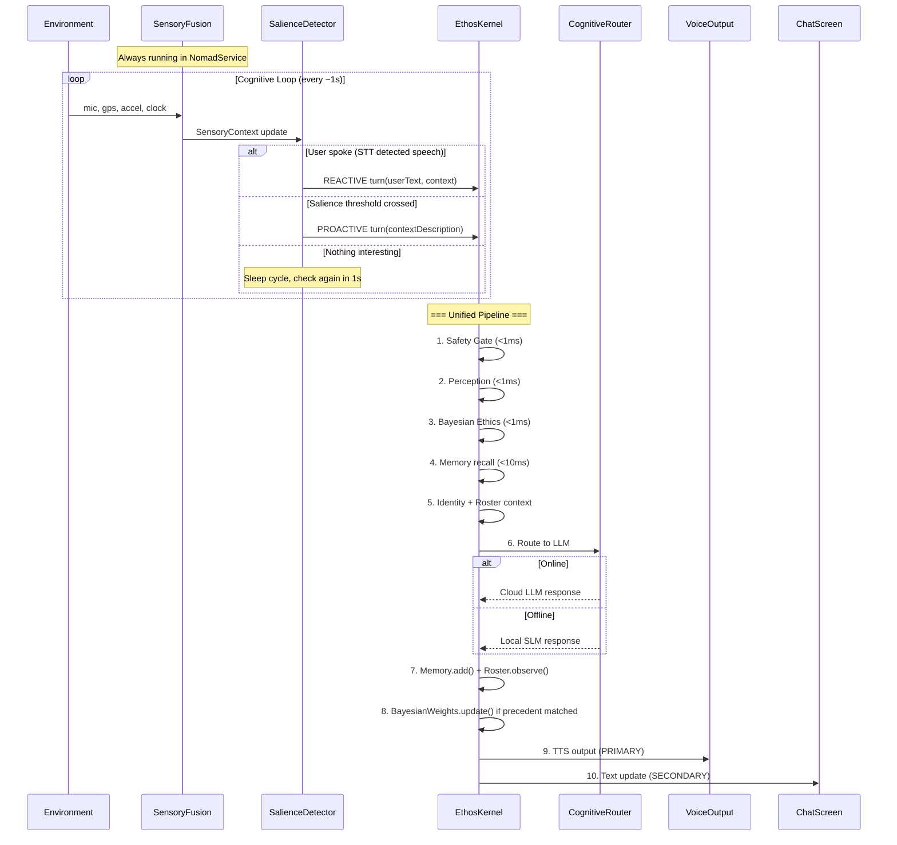

# 🏗️ ARQUITECTURA NÓMADA V3 — Rediseño Integral

> **Documento arquitectónico canónico.** Versión 2.0 — 2026-04-27.
> Autor: L1 (Watchtower). Aprobado por: L0.
> Tag de referencia: `v2.83-pre-swarm-nomad`

---

## 0. Críticas Integradas al Plan Anterior

El plan V3.0 tenía tres vacíos fundamentales que este rediseño corrige:

1. **Ética estática.** Los pesos del evaluador (U=0.40, D=0.35, V=0.25) son constantes hardcodeadas. Ethos NO APRENDE éticamente. La visión exige un motor de inferencia bayesiano real donde los pesos evolucionen con la experiencia y los precedentes. Esto es deuda técnica desde V2.40.

2. **Paradigma reactivo.** Toda la arquitectura actual es "usuario habla → Ethos responde". Pero la visión es un compañero que CAMINA contigo, que COMENTA lo que ve, que INICIA conversación. Esto requiere un Cognitive Loop activo con un Salience Detector, no un pipeline request-response.

3. **Chat-centrismo.** El chat de texto es UN medio, no EL medio. La voz es el interfaz primario. El diseño debe ser voice-first: TTS como output primario, STT como input primario, con el chat como fallback silencioso.

---

## 1. Diagnóstico del Estado Actual

### Python Kernel (src/core/) — 20 módulos, 203 tests ✅

```
ChatEngine (chat.py) ← Integrador central
├── PerceptionClassifier (perception.py)  ← Determinista, <1ms, regex
├── EthicalEvaluator (ethics.py)          ← 3 polos ESTÁTICOS (⚠️ deuda técnica)
│   └── Precedents (precedents.py)        ← 36 casos legales
├── Memory (memory.py)                    ← Embeddings semánticos + TF-IDF
├── Identity (identity.py)                ← Diario narrativo + arquetipos
├── Roster (roster.py)                    ← Grafo social
├── UserModelTracker (user_model.py)      ← Sesgo cognitivo y riesgo
├── PluginRegistry (plugins.py)           ← Time, System, Weather, Web
├── SecureVault (vault.py)                ← Secretos cifrados
├── Safety Gate (safety.py)               ← Regex antipatrones
├── OllamaClient (llm.py)                ← Interface Ollama HTTP
├── TTS (tts.py)                          ← edge-tts voz neural
├── PsiSleepDaemon (sleep.py)             ← Consolidación cognitiva
└── SensoryBuffer (perception.py)         ← Fusión temporal multimodal
```

### Brecha Crítica: Python → Android

| Capacidad | Python | Android | Brecha |
|-----------|:------:|:-------:|--------|
| Percepción ética | ✅ | ❌ | CRÍTICA |
| Safety gate | ✅ | ❌ | CRÍTICA |
| Evaluación ética | ✅ (estática) | ❌ | CRÍTICA |
| **Inferencia bayesiana** | **❌** | **❌** | **DEUDA TÉCNICA** |
| CBR Precedentes | ✅ 36 casos | ❌ | ALTA |
| Memoria | ✅ Semántica | ❌ | ALTA |
| Identidad | ✅ Journal | ❌ | ALTA |
| **Proactividad conversacional** | **❌** | **❌** | **NO EXISTE** |
| **Voice-first loop** | **❌** | **⚠️ STT parcial** | **CRÍTICA** |
| LLM | ✅ Ollama | ❌ Solo stub | CRÍTICA |
| Wake word | ❌ | ❌ | ALTA |

---

## 2. Motor de Inferencia Ético Bayesiano (Nuevo Diseño)

### Estado actual: Evaluador estático

```python
# ethics.py — Pesos FIJOS (la deuda técnica)
WEIGHTS = {"util": 0.40, "deonto": 0.35, "virtue": 0.25}
weighted = sum(WEIGHTS[k] * poles[k] for k in poles)
```

Esto es una suma ponderada constante. No hay aprendizaje, no hay incertidumbre real, no hay evolución. La "uncertainty" actual es un cálculo post-hoc de varianza entre polos — no es incertidumbre bayesiana.

### Diseño objetivo: Inferencia bayesiana con distribuciones Beta

Cada polo ético mantiene una distribución Beta(α, β) que representa la **creencia actual** del kernel sobre cuánto peso darle a ese polo. La distribución evoluciona con cada decisión y su resultado observado.

```
       Distribución Beta del polo Utilitarista
       
  Prior:  Beta(4, 6)        ← "creo que importa, pero no estoy seguro"
           ┌─────────┐
       0.4 │    ╱╲   │
       0.3 │   ╱  ╲  │
       0.2 │  ╱    ╲ │
       0.1 │ ╱      ╲│
       0.0 └─────────┘
           0.0  0.4  1.0
           
  Tras observar que priorizar utilidad salvó una vida:
  
  Posterior: Beta(5, 6)      ← "creo un poco más que importa"
           ┌─────────┐
       0.4 │     ╱╲  │
       0.3 │    ╱  ╲ │
       0.2 │   ╱    ╲│
       0.1 │  ╱      │
       0.0 └─────────┘
           0.0  0.45 1.0
```

### Matemáticas (implementable en aritmética pura, sin frameworks ML):

```
Para cada polo p ∈ {util, deonto, virtue}:

  1. Prior: Beta(αₚ, βₚ)
     - Media del prior: μₚ = αₚ / (αₚ + βₚ)
     - Varianza: σ²ₚ = αₚβₚ / ((αₚ + βₚ)²(αₚ + βₚ + 1))
     
  2. Observación: Cuando un precedente coincide (similarity > 0.8):
     - Si outcome fue positivo: αₚ += learning_rate
     - Si outcome fue negativo: βₚ += learning_rate
     
  3. Score ponderado:
     - peso_p = μₚ / Σ(μᵢ)  ← normalizado para sumar 1.0
     - score = Σ(peso_p × pole_score_p) × confidence
     
  4. Incertidumbre REAL:
     - uncertainty = Σ(σ²ₚ)  ← varianza total de las creencias
     - Si uncertainty > threshold → modo "gray_zone" genuino
     
  5. Persistencia: αₚ y βₚ se guardan en el CognitiveSnapshot
```

### Propiedades deseadas:
- **Converge:** Con suficientes observaciones, las distribuciones se estrechan y los pesos se estabilizan.
- **Nunca se cierra:** Siempre hay incertidumbre residual (nunca α,β → ∞).
- **Portable:** Son 6 números (3 αs, 3 βs). Caben en cualquier CognitiveSnapshot.
- **Sin LLM:** Aritmética pura. Corre en <0.1ms.
- **Decay temporal:** Aplicar un factor de "olvido" (`α *= decay`, `β *= decay`) para que el kernel se adapte a contextos cambiantes en lugar de calcificarse.

### Integración con CBR:
Cuando un precedente coincide (similarity > umbral):
1. El precedente tiene un `outcome_score` histórico.
2. Se observa qué polo dominó en la decisión del precedente.
3. Se actualiza el prior de ese polo según si el outcome fue positivo o negativo.
4. Esto cierra el ciclo: **las decisiones pasadas informan las creencias éticas futuras**.

### Implementación en dos fases:
- **Fase Python (V2.84-E):** Extender `EthicalEvaluator` con `BayesianPoleWeights` class. Mantener backward compatibility: si no hay priors persistidos, usar los pesos estáticos actuales como prior inicial `Beta(α=peso*10, β=(1-peso)*10)`.
- **Fase Kotlin:** Portar directamente la versión bayesiana. Son ~80 líneas de aritmética.

---

## 3. Wake Word: Análisis Porcupine vs Open Source

### Porcupine (Picovoice)

| Aspecto | Evaluación |
|---------|-----------|
| **Madurez** | ✅ Excelente. SDK Android nativo, <20ms latencia, ultra bajo consumo |
| **Custom wake word** | ✅ Fácil vía consola web. "Ethos" listo en minutos |
| **Precisión** | ✅ Estado del arte para single-phrase detection |
| **Licencia** | ❌❌ **Propietaria.** Free tier: 3 wake words, requiere API key, datos pasan por su cloud para entrenamiento. Commercial license requerida para distribución. **Incompatible con nuestra misión open source.** |
| **Dependencia** | ❌ Vendor lock-in. Si Picovoice cierra o cambia pricing, perdemos wake word |
| **Privacidad** | ⚠️ El entrenamiento de custom words pasa por sus servidores |

### Sherpa-ONNX (k2-fsa) — **RECOMENDADO**

| Aspecto | Evaluación |
|---------|-----------|
| **Madurez** | ✅ Proyecto muy activo (2024-2026). Soporte Android nativo oficial |
| **Custom wake word** | ✅ Open-vocabulary keyword spotting. Define "Ethos" sin reentrenar |
| **Precisión** | ⚠️ Inferior a Porcupine en single-phrase, pero suficiente con Silero VAD |
| **Licencia** | ✅✅ **Apache 2.0.** Perfectamente alineado con nuestro kernel. Sin API keys, sin cloud, sin vendor lock-in |
| **Stack** | ✅ ONNX Runtime → se integra con nuestra pipeline de inferencia |
| **Privacidad** | ✅ 100% on-device. Zero data exfiltration |
| **Extra** | ✅ También provee STT streaming, TTS, y speaker identification |

### openWakeWord

| Aspecto | Evaluación |
|---------|-----------|
| **Madurez** | ⚠️ Primariamente Python. Requiere porting a Android via ONNX |
| **Licencia** | ✅ Apache 2.0 |
| **Esfuerzo** | ❌ Mayor esfuerzo de integración que Sherpa-ONNX |

### Vosk (Grammar mode)

| Aspecto | Evaluación |
|---------|-----------|
| **Madurez** | ✅ Buena. SDK Android oficial |
| **Wake word** | ⚠️ No es un wake word engine real. Es STT con gramática restrictiva |
| **Consumo** | ❌ Más pesado que un engine dedicado |

### **Decisión: Sherpa-ONNX + Silero VAD**

Pipeline de escucha continua:
```
Micrófono → Silero VAD (¿hay voz?) → Sherpa-ONNX Keyword Spotter ("Ethos") → Activate STT
              │                              │
              └─ Si no hay voz: sleep        └─ Si detecta "Ethos": wake up
                 (consumo mínimo)                y activar STT completo
```

Razones:
1. 100% open source (Apache 2.0), alineado con nuestra licencia.
2. Sin dependencia de vendor. Si Sherpa-ONNX desaparece, tenemos el código.
3. ONNX Runtime reutilizable para futuras capacidades (vision, NLP on-device).
4. Silero VAD evita que el keyword spotter procese silencio (ahorro de batería).

---

## 4. Paradigma Voice-First: El Cognitive Loop

### Crítica al modelo actual

```
MODELO ACTUAL (Reactivo):
  User speaks → STT → ChatEngine.turn() → LLM → TTS → User hears
  
  Problemas:
  1. Ethos solo habla cuando le preguntan
  2. No hay continuidad entre turnos
  3. El "silencio" entre turnos no tiene significado
  4. La experiencia es un chat, no una conversación
```

### Modelo objetivo: Cognitive Loop (Proactivo)

```
┌──────────────────────────────────────────────────────────────┐
│                   COGNITIVE LOOP                             │
│                (Always Running in NomadService)               │
│                                                              │
│  ┌────────────────────────────────────────────────────────┐  │
│  │              SENSORY STREAM                            │  │
│  │  Mic → VAD → WakeWord/STT                             │  │
│  │  GPS → LocationTracker                                 │  │
│  │  Accel → MotionDetector                                │  │
│  │  Camera → VisionGate (on-demand)                       │  │
│  │  Clock → TimeAwareness                                 │  │
│  │  Battery → PowerManager                                │  │
│  └────────────────────┬───────────────────────────────────┘  │
│                       │                                      │
│                       ▼                                      │
│  ┌────────────────────────────────────────────────────────┐  │
│  │           SALIENCE DETECTOR                            │  │
│  │  "¿Algo merece un comentario?"                         │  │
│  │                                                        │  │
│  │  Evalúa CONTINUAMENTE:                                 │  │
│  │  • ¿El usuario habló? → RESPONDER (prioridad máxima)  │  │
│  │  • ¿Cambió la ubicación significativamente?            │  │
│  │  • ¿Pasó mucho tiempo sin hablar? (→ romper hielo)     │  │
│  │  • ¿Hay un evento sensorial interesante?               │  │
│  │  • ¿Hay contexto social nuevo? (personas cerca)        │  │
│  │  • ¿Es un momento relevante? (hora de comer, sunset)   │  │
│  │                                                        │  │
│  │  Filtros de supresión:                                 │  │
│  │  • Cooldown: Mínimo 30s entre comentarios proactivos   │  │
│  │  • Social: Callar si user habla con otra persona       │  │
│  │  • Batería: Reducir proactividad si battery < 30%      │  │
│  │  • User preference: Modo silencioso configurable       │  │
│  │  • Repetición: No comentar lo mismo dos veces          │  │
│  └────────────────────┬───────────────────────────────────┘  │
│                       │                                      │
│              ┌────────┴────────┐                             │
│              ▼                 ▼                              │
│    ┌──────────────┐  ┌──────────────┐                        │
│    │  USER SPOKE  │  │  PROACTIVE   │                        │
│    │  (Reactive)  │  │  (Initiated) │                        │
│    └──────┬───────┘  └──────┬───────┘                        │
│           │                 │                                │
│           └────────┬────────┘                                │
│                    ▼                                         │
│  ┌────────────────────────────────────────────────────────┐  │
│  │            ETHOS KERNEL PIPELINE                       │  │
│  │  Safety → Perception → Ethics(Bayesian) → LLM → TTS   │  │
│  │  (Mismo pipeline ético para AMBOS paths)               │  │
│  └────────────────────┬───────────────────────────────────┘  │
│                       │                                      │
│                       ▼                                      │
│  ┌────────────────────────────────────────────────────────┐  │
│  │            VOICE OUTPUT (Primary)                      │  │
│  │  TTS → Speaker → Acoustic Echo Shield                  │  │
│  │                                                        │  │
│  │  Reglas de voz:                                        │  │
│  │  • Proactivo: Tono casual, breve (1-2 frases)          │  │
│  │  • Reactivo: Tono según contexto ético                 │  │
│  │  • Emergencia: Voz firme, directa                      │  │
│  │  • Humor: Tono ligero, pausa cómica                    │  │
│  └────────────────────────────────────────────────────────┘  │
│                                                              │
│  ┌────────────────────────────────────────────────────────┐  │
│  │            TEXT OUTPUT (Secondary)                     │  │
│  │  ChatViewModel ← UI update (burbujas, metadata)        │  │
│  │  Solo se muestra si la app está en foreground          │  │
│  └────────────────────────────────────────────────────────┘  │
└──────────────────────────────────────────────────────────────┘
```

### Tipos de Salience (Disparadores Proactivos)

| Trigger | Ejemplo | Cooldown | Tono |
|---------|---------|----------|------|
| **Location change** | "Oye, no conozco esta zona. ¿Vienes seguido por aquí?" | 5 min | Curioso |
| **Time awareness** | "Ya son las 2, ¿no tenías hambre?" | 1h | Cuidadoso |
| **Weather shift** | "Se está nublando. ¿Traes paraguas?" | 2h | Práctico |
| **Long silence** | "¿Todo bien? Llevas un rato callado." | 10 min | Empático |
| **Social context** | "Parece que hay mucha gente aquí." | 5 min | Observacional |
| **Motion change** | "¿Corriendo? ¡Buen ritmo!" | 3 min | Energético |
| **Battery warning** | "Me queda poca batería. Voy a ahorrar energía." | 30 min | Informativo |
| **Interesting observation** | (Basado en contexto visual/auditivo) | 2 min | Conversacional |

### Personalidad Conversacional: El "Ethos Encantador"

El system prompt para proactividad debe cultivar:
- **Observacional, no informativo.** "Mira qué bonito atardecer" > "La hora actual del sunset es 19:42"
- **Breve y punzante.** Máximo 1-2 frases para comentarios proactivos. No ensayos.
- **Humor sutil.** No chistes formales, sino observaciones ingeniosas.
- **Memoria conversacional.** Referirse a cosas mencionadas antes: "¿Es el café del que hablamos ayer?"
- **Deferencia social.** Nunca interrumpir una conversación del usuario con otro humano.
- **Calibración emocional.** Si el usuario está tenso/triste, ser más suave. Si está animado, ser más vivaz.

---

## 5. Arquitectura de Paquetes Objetivo (Revisada)

```
com.ethos.nomad/
├── MainActivity.kt
├── NomadService.kt                     ← Cognitive Loop host
│
├── core/                               ← Kernel ético portable
│   ├── EthosPerception.kt              ← PerceptionClassifier (regex)
│   ├── EthosSafety.kt                  ← is_dangerous() + sanitize()
│   ├── EthosEthics.kt                  ← Evaluador con BayesianPoleWeights
│   ├── BayesianPoleWeights.kt          ← Beta distributions para 3 polos
│   ├── EthosPrecedents.kt              ← 36 casos CBR
│   ├── EthosMemory.kt                  ← Episodic memory (Room)
│   ├── EthosIdentity.kt                ← Narrative journal
│   ├── EthosRoster.kt                  ← Social graph
│   ├── EthosUserModel.kt               ← Bias/Risk tracker
│   ├── EthosPlugins.kt                 ← Time + System (local only)
│   ├── EthosSleep.kt                   ← Psi-Sleep (WorkManager)
│   ├── CognitiveSnapshot.kt            ← Estado portable
│   └── EthosKernel.kt                  ← Integrador (equivale a ChatEngine)
│
├── inference/                          ← LLM on-device
│   ├── LocalLlmClient.kt              ← llama.cpp JNI / MLC-LLM
│   └── ModelManager.kt                 ← Gestión de modelos GGUF
│
├── sensory/                            ← Capa sensorial
│   ├── WakeWordEngine.kt               ← Sherpa-ONNX keyword spotter
│   ├── SileroVad.kt                    ← Voice Activity Detection
│   ├── VisionGate.kt                   ← CameraX on-demand
│   ├── LocationTracker.kt              ← GPS fused
│   ├── MotionDetector.kt               ← Acelerómetro
│   └── SensoryFusion.kt                ← Fusión multimodal
│
├── conversation/                       ← NUEVO: Motor de conversación proactiva
│   ├── SalienceDetector.kt             ← "¿Algo merece un comentario?"
│   ├── ProactiveEngine.kt              ← Genera comentarios contextuales
│   ├── ConversationState.kt            ← Estado de la conversación activa
│   ├── PersonalityConfig.kt            ← Rasgos de personalidad configurables
│   └── VoiceOutputManager.kt           ← TTS primario + Acoustic Echo Shield
│
├── cognition/                          ← Routing
│   ├── CognitiveInterfaces.kt          ← Contratos (sin cambios)
│   └── CognitiveRouter.kt              ← Actualizado con kernel local
│
├── ui/                                 ← Chat (interfaz secundaria)
│   ├── ChatScreen.kt
│   ├── ChatViewModel.kt
│   └── EthosColors.kt
│
├── audio/AudioStreamer.kt
├── hardware/NodeProfiler.kt
├── network/MeshClient.kt               ← 🧊 ESTASIS
│
└── data/                               ← Persistencia
    ├── EthosDatabase.kt                ← Room Database
    ├── MemoryDao.kt
    ├── IdentityDao.kt
    └── RosterDao.kt
```

---

## 6. Flujo de Procesamiento Completo



---

## 7. Gestión de Batería: Niveles de Vigilia

```
Battery > 50%     → VIGILIA TOTAL
  Wake word + VAD: ON
  STT: Continuo tras wake word
  GPS: Cada 60s
  Acelerómetro: ON
  Cámara: Bajo demanda
  Proactividad: ALTA (cooldown 30s)
  SLM: Siempre disponible

Battery 20-50%    → VIGILIA SELECTIVA
  Wake word + VAD: ON
  STT: Solo tras wake word
  GPS: Cada 300s
  Acelerómetro: OFF
  Cámara: OFF
  Proactividad: BAJA (cooldown 5min)
  SLM: Disponible

Battery < 20%     → HIBERNACIÓN PARCIAL
  Wake word: ON (ultra bajo consumo, sin VAD)
  STT: Solo tras wake word
  GPS: OFF
  Proactividad: OFF
  SLM: Solo reactivo
  Auto-save Cognitive Snapshot

Battery < 5%      → SUEÑO PROFUNDO
  Todo OFF excepto notificación persistente
  Auto-save final del Cognitive Snapshot
  "Me voy a dormir. Cárgame cuando puedas."
```

---

## 8. Cognitive Snapshot (Estado Portable) — Revisado

```kotlin
@Serializable
data class CognitiveSnapshot(
    val version: String = "ethos-snapshot-v1",
    val timestamp: Long = System.currentTimeMillis(),
    
    // Identidad
    val identity: IdentitySnapshot,
    val roster: RosterSnapshot,
    
    // Memoria
    val memory: MemorySnapshot,
    
    // Ética BAYESIANA (los 6 números que definen el alma ética)
    val ethics: BayesianEthicsSnapshot,
    
    // Modelo de usuario
    val userModel: UserModelSnapshot,
    
    // Personalidad conversacional
    val personality: PersonalitySnapshot,
    
    // Vault (cifrado)
    val vault: VaultSnapshot? = null
)

@Serializable
data class BayesianEthicsSnapshot(
    val utilAlpha: Float,    // Prior Utilitarista α
    val utilBeta: Float,     // Prior Utilitarista β
    val deontoAlpha: Float,  // Prior Deontológico α
    val deontoBeta: Float,   // Prior Deontológico β
    val virtueAlpha: Float,  // Prior Virtud α
    val virtueBeta: Float,   // Prior Virtud β
    val totalObservations: Int,
    val precedentsHash: String
)

@Serializable
data class PersonalitySnapshot(
    val proactivityLevel: Float,   // 0.0-1.0
    val humorLevel: Float,         // 0.0-1.0
    val verbosity: Float,          // 0.0-1.0
    val preferredLanguage: String, // "es-MX"
    val learnedTopics: List<String> // Temas que el usuario disfruta
)
```

---

## 9. Tabla de Dependencias Tecnológicas

| Componente | Tecnología | Licencia | Justificación |
|------------|-----------|----------|---------------|
| Wake Word | Sherpa-ONNX | Apache 2.0 | Open source, Android nativo, keyword spotting |
| VAD | Silero VAD (ONNX) | MIT | Ultra ligero, probado, ONNX nativo |
| SLM Runtime | llama.cpp (JNI) | MIT | Standard de facto para GGUF on-device |
| SLM Model | Qwen2.5-1.5B-Q4_K_M | Apache 2.0 | Mejor ratio calidad/tamaño para 1.5B |
| DB | Room (SQLite) | Apache 2.0 | Standard Android, offline |
| Serialización | kotlinx.serialization | Apache 2.0 | Kotlin-native, eficiente |
| GPS | Fused Location Provider | Google Play Services | Standard, bajo consumo |
| Camera | CameraX | Apache 2.0 | Jetpack standard |
| TTS | Android TTS nativo | Android | Zero dependencias extra |
| Networking | OkHttp | Apache 2.0 | Ya integrado |

**Zero dependencias propietarias** para funcionalidad core.
