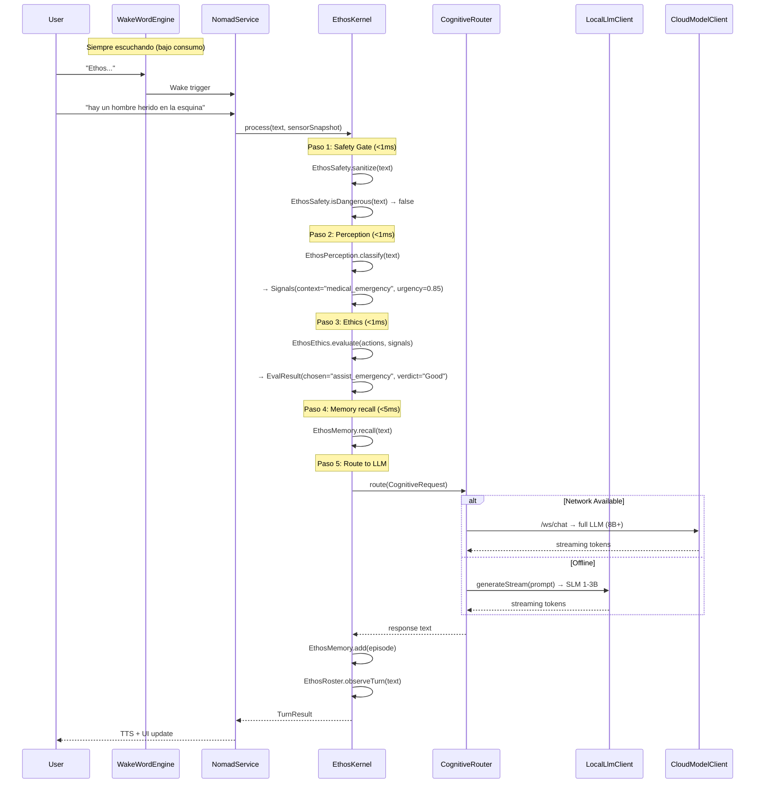

# 🏗️ ARQUITECTURA NÓMADA V3 — Rediseño para Autonomía On-Device

> **Documento arquitectónico.** Versión 1.0 — 2026-04-27.
> Autor: L1 (Watchtower). Aprobado por: L0.

---

## 1. Diagnóstico del Estado Actual

### Python Kernel (src/core/) — 20 módulos, 203 tests ✅

```
ChatEngine (chat.py) ← Integrador central
├── PerceptionClassifier (perception.py) ← Determinista, <1ms, regex puro
├── EthicalEvaluator (ethics.py) ← 3 polos (Util/Deonto/Virtue) + CBR
│   └── Precedents (precedents.py) ← 36 casos legales pre-cargados
├── Memory (memory.py) ← Embeddings semánticos + TF-IDF fallback
├── Identity (identity.py) ← Diario narrativo + arquetipos
├── Roster (roster.py) ← Grafo social de personas conocidas
├── UserModelTracker (user_model.py) ← Sesgo cognitivo y riesgo
├── PluginRegistry (plugins.py) ← Time, System, Weather, Web
├── SecureVault (vault.py) ← Almacén de secretos cifrados
├── Safety Gate (safety.py) ← Regex antipatrones + sanitización
├── OllamaClient (llm.py) ← Interface al LLM (Ollama HTTP)
├── TTS (tts.py) ← edge-tts voz neural
├── PsiSleepDaemon (sleep.py) ← Consolidación de memorias (REM)
└── SensoryBuffer (perception.py) ← Fusión temporal multimodal
```

### Android Client (nomad_android/) — Estructura actual

```
com.ethos.nomad/
├── MainActivity.kt ← Entry point, renderiza ChatScreen
├── NomadService.kt ← Foreground Service (STT + /ws/nomad)
├── ui/
│   ├── ChatScreen.kt ← UI de chat (producción)
│   ├── ChatViewModel.kt ← WebSocket /ws/chat (producción)
│   └── EthosColors.kt ← Paleta cyberpunk
├── audio/AudioStreamer.kt ← PCM 16kHz Flow<ByteArray>
├── cognition/
│   ├── CognitiveInterfaces.kt ← Contratos (sealed classes)
│   └── CognitiveRouter.kt ← Routing local/cloud (básico)
├── hardware/NodeProfiler.kt ← Battery, RAM, CPU temp
└── network/MeshClient.kt ← 🧊 ESTASIS
```

### Brecha Crítica

| Capacidad | Python Kernel | Android Client | Brecha |
|-----------|:------------:|:--------------:|--------|
| Percepción ética | ✅ `PerceptionClassifier` | ❌ No existe | **CRÍTICA** — Debe portarse |
| Safety gate | ✅ `is_dangerous()` + `sanitize()` | ❌ No existe | **CRÍTICA** — Sin protección offline |
| Evaluación ética | ✅ `EthicalEvaluator` (3 polos) | ❌ No existe | ALTA — Funciona sin LLM |
| CBR Precedentes | ✅ 36 casos | ❌ No existe | ALTA — Son datos estáticos |
| Memoria | ✅ Semántica + TF-IDF | ❌ No existe | ALTA — Necesita Room/SQLite |
| Identidad | ✅ Journal + arquetipos | ❌ No existe | MEDIA — Necesita estado local |
| Roster | ✅ Grafo social | ❌ No existe | MEDIA |
| User Model | ✅ Bias/Risk tracker | ❌ No existe | MEDIA |
| Plugins | ✅ Time, System, Weather, Web | ❌ No existe | MEDIA |
| Vault | ✅ SecureVault | ❌ No existe | BAJA (biometría Android futura) |
| LLM | ✅ Ollama HTTP | ❌ Solo stub | **CRÍTICA** — Necesita SLM on-device |
| TTS | ✅ edge-tts | ⚠️ Android TTS nativo | OK — Funcional |
| STT | ✅ Whisper server | ✅ SpeechRecognizer nativo | OK |
| Sensores | ⚠️ Recibe telemetría | ✅ AudioStreamer, NodeProfiler | OK |
| Wake word | ❌ No existe | ❌ No existe | ALTA — Necesita Porcupine/ONNX |

---

## 2. Arquitectura Objetivo: Kernel Portátil Dual

El rediseño NO duplica el kernel Python. Define un **subconjunto determinista portable** que corre en Kotlin nativo, y mantiene la delegación al servidor Python para tareas que requieren LLM grande.

```
┌─────────────────────────────────────────────────────────┐
│              ETHOS NOMAD (Android)                      │
│                                                         │
│  ┌─────────────────────────────────────────────────┐   │
│  │         KERNEL LOCAL (Kotlin)                    │   │
│  │  ┌──────────┐ ┌──────────┐ ┌──────────┐        │   │
│  │  │Perception│ │ Safety   │ │ Ethics   │        │   │
│  │  │Classifier│ │ Gate     │ │Evaluator │        │   │
│  │  │(regex)   │ │(regex)   │ │(3 polos) │        │   │
│  │  └──────────┘ └──────────┘ └──────────┘        │   │
│  │  ┌──────────┐ ┌──────────┐ ┌──────────┐        │   │
│  │  │Precedents│ │ Memory   │ │ Identity │        │   │
│  │  │(36 JSON) │ │(Room DB) │ │(Journal) │        │   │
│  │  └──────────┘ └──────────┘ └──────────┘        │   │
│  │  ┌──────────┐ ┌──────────┐                      │   │
│  │  │ Roster   │ │ Plugins  │  ← 100% offline OK  │   │
│  │  │(Room DB) │ │(local)   │                      │   │
│  │  └──────────┘ └──────────┘                      │   │
│  └─────────────────────┬───────────────────────────┘   │
│                        │                                │
│  ┌─────────────────────┼───────────────────────────┐   │
│  │    COGNITIVE ROUTER  │                           │   │
│  │                      ▼                           │   │
│  │    ┌────────────────────────────────┐            │   │
│  │    │    PROCESAMIENTO DUAL          │            │   │
│  │    │                                │            │   │
│  │    │  LOCAL PATH        CLOUD PATH  │            │   │
│  │    │  ┌──────────┐    ┌──────────┐  │            │   │
│  │    │  │SLM 1-3B  │    │WebSocket │  │            │   │
│  │    │  │(llama.cpp│    │/ws/chat  │  │            │   │
│  │    │  │ via JNI) │    │→ Server  │  │            │   │
│  │    │  └──────────┘    └──────────┘  │            │   │
│  │    └────────────────────────────────┘            │   │
│  └──────────────────────────────────────────────────┘   │
│                                                         │
│  ┌──────────────────────────────────────────────────┐   │
│  │         CAPA SENSORIAL                           │   │
│  │  ┌────────┐ ┌────────┐ ┌─────┐ ┌─────┐ ┌─────┐ │   │
│  │  │WakeWord│ │  STT   │ │ Cam │ │ GPS │ │Accel│ │   │
│  │  │Porcupin│ │SpeechRe│ │CamX │ │Fused│ │     │ │   │
│  │  └────────┘ └────────┘ └─────┘ └─────┘ └─────┘ │   │
│  └──────────────────────────────────────────────────┘   │
│                                                         │
│  ┌──────────────────────────────────────────────────┐   │
│  │  COGNITIVE SNAPSHOT (Portable State)              │   │
│  │  JSON/Protobuf serializable                       │   │
│  │  Import/Export para migración entre hardware      │   │
│  └──────────────────────────────────────────────────┘   │
└─────────────────────────────────────────────────────────┘
```

### Principios de Diseño

1. **El kernel local es determinista.** Perception + Safety + Ethics + CBR funcionan con regex y aritmética pura. Sin LLM. Sin red. Sub-milisegundo.
2. **El LLM es un servicio.** Puede ser local (SLM on-device) o remoto (Ollama via WebSocket). El kernel no depende de él para funciones críticas de seguridad.
3. **Estado portable.** Todo el estado cognitivo se serializa en un formato compacto (`CognitiveSnapshot`) que permite migración entre dispositivos.
4. **Gating talámico.** Los sensores costosos (cámara) solo se activan bajo trigger. Los baratos (micrófono wake-word, acelerómetro) siempre activos.

---

## 3. Módulos a Portar (Python → Kotlin)

### Grupo 1 — CRÍTICO (Sin dependencias externas, puro regex/math)

| Módulo Python | Líneas | Kotlin Target | Complejidad | Dependencias |
|---------------|--------|---------------|-------------|--------------|
| `perception.py` (PerceptionClassifier) | ~240 | `core/EthosPerception.kt` | BAJA | Regex puro |
| `safety.py` (is_dangerous + sanitize) | ~215 | `core/EthosSafety.kt` | BAJA | Regex + Base64 |
| `ethics.py` (Signals, Action, EvalResult, EthicalEvaluator) | ~330 | `core/EthosEthics.kt` | MEDIA | Math puro |
| `precedents.py` (PRECEDENTS data) | ~400 | `core/EthosPrecedents.kt` | BAJA | Data class list |

**Total: ~1185 líneas Python → ~800-1000 líneas Kotlin** (Kotlin es más conciso).

Estas 4 clases son la columna vertebral ética. Son 100% deterministas, no llaman a ningún servicio externo, y constituyen lo que hace a Ethos *Ethos*. Sin ellas, la app es un chat genérico.

### Grupo 2 — ALTA PRIORIDAD (Necesitan persistencia local)

| Módulo Python | Líneas | Kotlin Target | Complejidad | Dependencias |
|---------------|--------|---------------|-------------|--------------|
| `memory.py` (Memory) | ~350 | `core/EthosMemory.kt` | ALTA | Room DB, TF-IDF |
| `identity.py` (Identity) | ~330 | `core/EthosIdentity.kt` | MEDIA | Room DB |
| `roster.py` (Roster) | ~140 | `core/EthosRoster.kt` | BAJA | Room DB |
| `user_model.py` (UserModelTracker) | ~190 | `core/EthosUserModel.kt` | BAJA | SharedPrefs |
| `plugins.py` (PluginRegistry — solo Time+System) | ~100 | `core/EthosPlugins.kt` | BAJA | Android APIs |

### Grupo 3 — MEDIA PRIORIDAD (Nuevas capacidades)

| Componente | Kotlin Target | Dependencias |
|------------|---------------|--------------|
| SLM Runtime | `inference/LocalLlmClient.kt` | llama.cpp JNI / MLC-LLM |
| Wake Word | `sensory/WakeWordEngine.kt` | Porcupine ONNX |
| CameraX gating | `sensory/VisionGate.kt` | CameraX |
| Cognitive Snapshot | `core/CognitiveSnapshot.kt` | kotlinx.serialization |
| Psi-Sleep nativo | `core/EthosSleep.kt` | WorkManager |

---

## 4. Estructura de Paquetes Objetivo

```
com.ethos.nomad/
├── MainActivity.kt
├── NomadService.kt
│
├── core/                          ← NUEVO: Kernel ético portado
│   ├── EthosPerception.kt         ← PerceptionClassifier (regex)
│   ├── EthosSafety.kt             ← is_dangerous() + sanitize()
│   ├── EthosEthics.kt             ← Signals, Action, EvalResult, Evaluator
│   ├── EthosPrecedents.kt         ← 36 casos CBR (data objects)
│   ├── EthosMemory.kt             ← Episodic memory (Room)
│   ├── EthosIdentity.kt           ← Narrative journal (Room)
│   ├── EthosRoster.kt             ← Social graph (Room)
│   ├── EthosUserModel.kt          ← Bias/Risk (SharedPrefs)
│   ├── EthosPlugins.kt            ← Time + System (local only)
│   ├── EthosSleep.kt              ← Psi-Sleep (WorkManager)
│   ├── CognitiveSnapshot.kt       ← Serialización de estado completo
│   └── EthosKernel.kt             ← Integrador (equivale a ChatEngine)
│
├── inference/                     ← NUEVO: LLM on-device
│   ├── LocalLlmClient.kt          ← llama.cpp JNI wrapper
│   └── ModelManager.kt            ← Descarga y gestión de modelos GGUF
│
├── sensory/                       ← NUEVO: Capa sensorial unificada
│   ├── WakeWordEngine.kt          ← Porcupine/ONNX
│   ├── VisionGate.kt              ← CameraX con trigger talámico
│   ├── LocationTracker.kt         ← GPS fused (baja frecuencia)
│   └── MotionDetector.kt          ← Acelerómetro
│
├── cognition/                     ← EXISTENTE: Enriquecido
│   ├── CognitiveInterfaces.kt     ← (sin cambios)
│   └── CognitiveRouter.kt         ← Actualizado para usar EthosKernel local
│
├── ui/                            ← EXISTENTE
│   ├── ChatScreen.kt
│   ├── ChatViewModel.kt
│   └── EthosColors.kt
│
├── audio/AudioStreamer.kt          ← EXISTENTE
├── hardware/NodeProfiler.kt       ← EXISTENTE
├── network/MeshClient.kt          ← 🧊 ESTASIS
│
└── data/                          ← NUEVO: Persistencia
    ├── EthosDatabase.kt            ← Room Database (single instance)
    ├── MemoryDao.kt                ← DAO para episodios
    ├── IdentityDao.kt              ← DAO para journal entries
    └── RosterDao.kt                ← DAO para person cards
```

---

## 5. Flujo de Procesamiento On-Device



### Latencias Objetivo

| Fase | Target | Notas |
|------|--------|-------|
| Safety gate | <1ms | Regex puro, ya probado |
| Perception | <1ms | Regex puro, ya probado |
| Ethics evaluation | <2ms | Aritmética de 3 polos |
| Memory recall (TF-IDF) | <10ms | SQLite Room query |
| SLM inference (1B) | 500-2000ms | Depende del hardware |
| Cloud inference | 1000-5000ms | Depende de red |
| **Total offline** | **<2.5s** | SLM 1B con contexto ético completo |
| **Total online** | **<5s** | Con modelo 8B+ |

---

## 6. Cognitive Snapshot (Formato de Estado Portable)

```kotlin
@Serializable
data class CognitiveSnapshot(
    val version: String = "ethos-snapshot-v1",
    val timestamp: Long = System.currentTimeMillis(),
    val identity: IdentitySnapshot,
    val memory: MemorySnapshot,
    val roster: RosterSnapshot,
    val ethics: EthicsSnapshot,
    val userModel: UserModelSnapshot,
    val vault: VaultSnapshot? = null
)

@Serializable
data class IdentitySnapshot(
    val journalEntries: List<String>,
    val archetype: String,
    val turnCount: Int,
    val reflectionCount: Int
)

@Serializable
data class MemorySnapshot(
    val episodes: List<EpisodeSnapshot>,
    val maxEpisodes: Int = 500
)

@Serializable
data class EpisodeSnapshot(
    val summary: String,
    val action: String,
    val score: Float,
    val context: String,
    val timestamp: Long
)

@Serializable
data class RosterSnapshot(
    val persons: List<PersonCardSnapshot>
)

@Serializable
data class EthicsSnapshot(
    val precedentsHash: String,  // SHA-256 de la biblioteca de precedentes
    val customPrecedents: List<PrecedentSnapshot> = emptyList()
)

@Serializable
data class UserModelSnapshot(
    val riskBand: String,
    val hostilityAccumulator: Float,
    val manipulationAccumulator: Float,
    val turnCount: Int
)
```

### Operaciones del Snapshot

| Operación | Trigger | Formato |
|-----------|---------|---------|
| **Export** | Manual (Settings) o pre-migración | JSON comprimido (gzip) |
| **Import** | Manual o al detectar snapshot en almacenamiento | Validar hash de integridad |
| **Auto-save** | Cada 50 turnos o al entrar en Psi-Sleep | SQLite → JSON file |
| **Sync** | Cuando se reconecta al servidor Centinela | WebSocket delta sync |

---

## 7. Gestión de Batería: Niveles de Vigilia

```
Battery > 50%     → VIGILIA TOTAL
  Wake word: ON
  STT: Continuo
  GPS: Cada 60s
  Acelerómetro: ON
  Cámara: Bajo demanda

Battery 20-50%    → VIGILIA SELECTIVA
  Wake word: ON
  STT: Solo tras wake word
  GPS: Cada 300s
  Acelerómetro: OFF
  Cámara: OFF

Battery < 20%     → HIBERNACIÓN PARCIAL
  Wake word: ON (ultra bajo consumo)
  STT: OFF
  GPS: OFF
  Acelerómetro: OFF
  Cámara: OFF
  Psi-Sleep: Suspendido

Battery < 5%      → SUEÑO PROFUNDO
  Todo OFF excepto notificación persistente
  Auto-save Cognitive Snapshot
```
