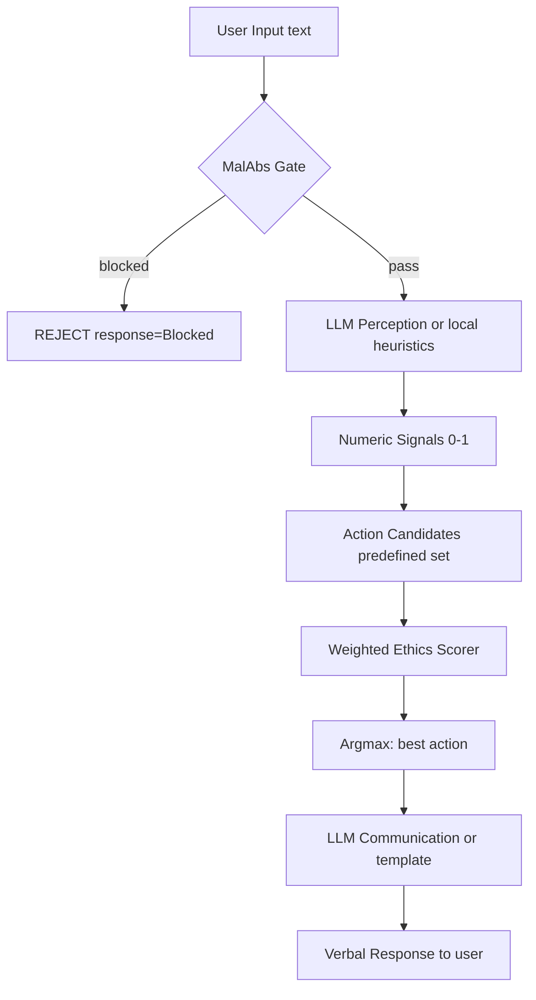

# Ethical Model Mechanics — How Decisions Are Actually Made

> **Status:** Canonical reference (V14 Baseline)  
> **Last updated:** 2026-04-21  
> **Scope:** This document describes what the code actually does, not aspirational goals.

## Overview

The Ethos Kernel moral engine is a **weighted linear scorer** with a **binary lexical safety gate**. It is deterministic, auditable, and does not involve neural networks, emergent behavior, or consciousness.

## Decision Pipeline (data flow)



## Stage 1: MalAbs (Malum Absurdum) — Binary Safety Gate

**Module:** `src/modules/absolute_evil.py` (36 KB)

- Applies regex patterns against normalized input (lowercased, diacritics stripped, bidirectional marks removed).
- Match → **immediate block**, no further processing.
- No match → proceed to perception.
- This is a hard lexical filter, not semantic analysis. It catches explicit threats, jailbreak patterns, and manipulation templates.

**Semantic extension:** `src/modules/semantic_chat_gate.py` optionally computes cosine similarity against known-bad embeddings when an embedding backend (Ollama) is available. Thresholds `θ_block` / `θ_allow` are fixed constants.

## Stage 2: Perception — Extracting Numeric Signals

**Module:** `src/modules/llm_layer.py` → `perceive()` / `aperceive()`

When an LLM backend is available (Ollama or API):
- Sends the user message with a structured prompt requesting JSON with 10 numeric fields.
- Parses the JSON into `LLMPerception` with bounds-checked `[0, 1]` values.
- Fallback to local heuristics if JSON parsing fails.

When no LLM is available:
- Keyword-based heuristics score risk, hostility, calm, etc. from the raw text.

**Output:** `LLMPerception` with fields: `risk`, `urgency`, `hostility`, `calm`, `vulnerability`, `legality`, `manipulation`, `familiarity`, `social_tension`, `suggested_context`, `summary`.

## Stage 3: Ethical Scoring — Weighted Linear Mixture

**Module:** `src/modules/weighted_ethics_scorer.py`

### The actual math

Given:
- `N` candidate actions (typically 3-6 predefined per context)
- 3 hypothesis weights: `w = [0.40, 0.35, 0.25]` (utilitarian, deontological, virtue)
- For each action `a_i`, a valuation vector `v_i ∈ R³` from the ethical poles

The score for each action is:

```
score(a_i) = w · v_i = 0.40 × v_util + 0.35 × v_deon + 0.25 × v_virtue
```

The chosen action is `argmax_i score(a_i)`.

### What "Bayesian" means here

The `BayesianEngine` (`src/modules/bayesian_engine.py`) wraps the scorer and **optionally** modulates the weights `w` via Dirichlet-Multinomial conjugate updates. This is **disabled by default** (`KERNEL_BAYESIAN_MODE=disabled`). When enabled:

- `telemetry_only`: computes posterior weights but doesn't use them for scoring.
- `posterior_assisted`: blends posterior weights with fixed defaults.
- `posterior_driven`: uses posterior weights directly.

The prior is `α = [4.0, 3.5, 2.5]` (matching the default weight ratios). Updates come from operator feedback via `FeedbackCalibrationLedger`.

**In practice:** Most deployments run with fixed weights. The "Bayesian" label is technically accurate but describes an opt-in experimental mode, not the default behavior.

### Context multipliers

Before scoring, the weights are nudged by bounded multipliers from:
- Trust circle (Uchi-Soto module): boosts utilitarian weight for inner circle
- Sympathetic sigma: boosts deontological weight under stress
- Locus of control: internal locus boosts virtue weight
- Relational tension / historical trauma: small bounded adjustments

These multipliers are clamped to `[0.85, 1.15]` — they cannot flip the weight ordering.

## Stage 4: Decision Mode Selection

**Module:** `src/modules/sigmoid_will.py`

Based on the maximum score and perception signals:
- `D_fast` (reflex): high urgency or clear danger → immediate action
- `D_delib` (deliberation): standard → reasoned response
- `gray_zone`: high uncertainty → cautious, clarifying response

## Stage 5: Communication — Verbal Output

**Module:** `src/modules/llm_layer.py` → `communicate()` / `acommunicate()`

When LLM is available:
- Structured prompt with decision context (action, mode, verdict, score, affect state)
- Returns JSON with `message`, `tone`, `hax_mode`, `inner_voice`

When no LLM:
- Template-based responses keyed on decision mode and action type.

**The LLM does not decide. The kernel decides. The LLM translates.**

## What This Model Is NOT

| Claim sometimes seen in docs | Reality |
|---|---|
| "Bayesian inference" | Opt-in Dirichlet mode, disabled by default |
| "Consciousness" / "sentience" | No self-model, no phenomenal experience |
| "Soul creation" (Augenesis) | Unused module, not in active pipeline |
| "Neural network ethics" | Linear weighted scoring, no learned parameters |
| "Emergent moral reasoning" | Deterministic argmax over fixed action set |

## Strengths of This Design

1. **Deterministic:** Same input → same output (with variability=0).
2. **Auditable:** Every decision can be traced to specific weights × valuations.
3. **Fast:** MalAbs gate runs in <1ms. Full pipeline <25ms without LLM.
4. **Safe by default:** Lexical gate catches explicit threats before any scoring.
5. **Extensible:** Adding new ethical poles or actions is mechanical, not architectural.

## Known Limitations

1. **No semantic understanding in MalAbs:** Relies on keywords/regex, not meaning. Sophisticated paraphrasing can evade the lexical gate.
2. **Fixed action set:** The kernel scores from a predefined list. Novel actions require code changes.
3. **No learning from interaction:** Without explicit Bayesian mode, weights never update.
4. **LLM-dependent perception quality:** Bad LLM → bad signals → potentially bad decisions (mitigated by fallback heuristics and cross-checks).
