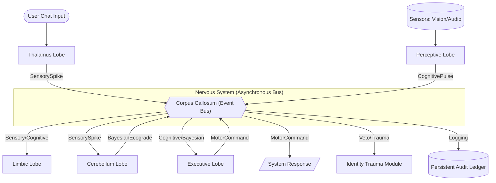

# Antigravity Tri-Lobe Core Architecture

This document tracks the visual evolution of the Tri-Lobe core. **AI Agents MUST update this diagram if structural changes are made to the interfaces.**

## High-Level Cognitive Flow

## System Dependencies
- **Identity Integrity:** Ensures the Node ID and reputation are stable.
- **Basal Ganglia:** Computes the 6-axis resonance.
- **Cerebellum:** Daemon thread for hardware interrupts (100Hz).
