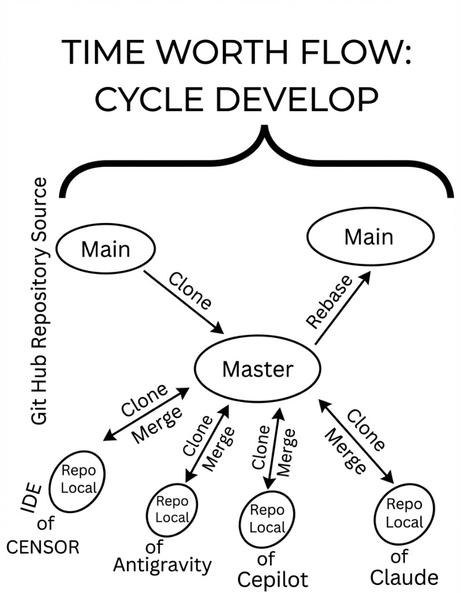

# Multi-office Git workflow (*Time worth flow — cycle develop*)

This note **institutionalizes** a Git branching pattern for **distributed teams** (several local offices or agent pools) that share one GitHub repository. It is the same **conceptual model** as the team diagram below.



## Purpose

- Give **analogous teams** a **single, copyable convention**: where to integrate day to day, how locals relate to production, and how promotion to `main` is supposed to happen.
- Keep **production** (`main`) **stable and reviewable**, while allowing **parallel work** on a team integration line.

## Branch model (generic)

| Layer | Branch pattern | Role |
|--------|----------------|------|
| **Production** | `main` | Canonical line on GitHub. Treat as **production**: public-facing material that lives on this line (for example marketing or reference pages), bibliography, and **all merged repo-facing text** must follow the **English-only** merge policy in [`CONTRIBUTING.md`](../../CONTRIBUTING.md). |
| **Team integration** | `master-<TeamSlug>` | Hub for a named team (replace `<TeamSlug>` with a short identifier, e.g. `Cursor`, `LabEast`). Cut from `main`. **Local offices merge here** when work is ready for the shared line—not directly to `main` unless maintainers say otherwise. |
| **Shared team work** | `<team-slug>-team` | Optional but recommended: day-to-day branch cut from `master-<TeamSlug>` (use a **lowercase slug**, e.g. `cursor-team`). Multiple clones pull this line (or topic branches from it), then integrate back into `master-<TeamSlug>`. |

**Example (this repository, Cursor org):** `master-Cursor` ← from `main`; `cursor-team` ← from `master-Cursor`.

## Operations (summary)

1. **Refresh integration from production** — Regularly align `master-<TeamSlug>` with `main` (diagram “clone” / sync: e.g. merge or rebase from `origin/main` per team policy) so the hub does not drift from production intent.
2. **Locals → integration** — Each office merges reviewed work into `master-<TeamSlug>` (or opens PRs into it).
3. **Integration → production** — Promotion `master-<TeamSlug>` → `main` is a **maintainer / release** action (merge or rebase per policy). Follow normal PR review and [`CONTRIBUTING.md`](../../CONTRIBUTING.md).

Exact commands depend on branch protection and remote layout; prefer the same patterns as the rest of the project.

---

## Incremental-sync rule — keeping up with peer team branches (Rule C-1)

> **Added:** 2026-04-15. Applies to all team members and agent pools working from
> a `master-<TeamSlug>` hub.

### Motivation

Multiple parallel teams (currently `master-claude`, `master-Cursor`,
`master-antigravity`, …) each push incremental improvements that the others
need. Without a shared pull discipline, each hub drifts and the eventual
merge-to-`main` becomes risky.

### The rule

Before starting a new work session **or** opening a PR that touches shared
files, each team member must:

1. **Fetch all remotes** (safe, never moves local branches):
   ```bash
   git fetch origin
   ```

2. **Identify incremental changes** in every peer `master-*` branch since your
   last common ancestor:
   ```bash
   # List commits in a peer branch not yet in yours
   git log origin/master-Cursor ^HEAD --oneline
   git log origin/master-antigravity ^HEAD --oneline
   # (repeat for each master-* present in origin)
   ```

3. **Merge only if no conflicts are expected** — do a dry-run check first:
   ```bash
   git merge --no-commit --no-ff origin/master-Cursor
   git merge --abort          # ← always abort the dry run; inspect before real merge
   ```
   If the dry run shows conflicts in your working files, **do not merge**;
   open a coordination issue instead.

4. **Perform the merge** when the check is clean:
   ```bash
   git merge --no-ff origin/master-Cursor \
       -m “merge(sync): pull incremental changes from master-Cursor (YYYY-MM-DD)”
   ```
   Use a conventional `merge(sync):` prefix so the log stays readable.

5. **Push your hub** after the merge:
   ```bash
   git push origin master-<YourTeamSlug>
   ```

### Practical shortcuts (one-liner per session start)

```bash
# Fetch + show what each peer team has that you don't
git fetch origin && \
  for b in $(git branch -r | grep 'origin/master-' | grep -v HEAD); do \
    echo “=== $b ===”; git log $b ^HEAD --oneline | head -5; \
  done
```

```bash
# Merge a specific peer incrementally (replace 'master-Cursor' as needed)
git fetch origin master-Cursor && \
  git merge --no-ff origin/master-Cursor \
    -m “merge(sync): incremental pull from master-Cursor $(date +%Y-%m-%d)”
```

### When to skip

- Your local branch is already **ahead** of the peer (no new commits in their
  branch since your last sync) → `git log origin/master-Peer ^HEAD --oneline`
  shows nothing; nothing to do.
- The peer branch has **conflicting** changes in files you are actively editing
  → defer to end-of-sprint or resolve through a shared coordination PR.
- A peer branch is a **work-in-progress** tag (e.g. `master-Cursor-wip`) →
  treat with extra caution; only merge `master-*` branches that have been
  integrated, not raw feature spikes.

### Agent-specific guidance

Agents (Claude, Cursor, etc.) must apply this rule at session start. The
recommended flow for an agent working on `master-claude`:

```
git fetch origin
git log origin/master-Cursor ^HEAD --oneline   # inspect
git log origin/master-antigravity ^HEAD --oneline
# if either shows new commits and no conflicts → merge as above
# then proceed with own work
```

This rule supplements (does not replace) the existing “Refresh from
production” operation (step 1 above). Both apply.

## Agent and IDE guidance

For **Cursor** and other agents, the durable rule text (redundancy checks, safety expectations, and this workflow) lives in:

- [`.cursor/rules/collaboration-prioritization.mdc`](../../.cursor/rules/collaboration-prioritization.mdc)
- **Generalized onboarding pack:** [`COLLABORATIVE_METHOD_GENERALIZATION_GUIDE.md`](COLLABORATIVE_METHOD_GENERALIZATION_GUIDE.md) (required reading order, task card, DoD, and quality gate references).
- **Cursor integration gate:** [`CURSOR_CROSS_TEAM_INTEGRATION_GATE.md`](CURSOR_CROSS_TEAM_INTEGRATION_GATE.md) (cross-team interlace readiness and reproducible checks).

## Language policy reminder

- **Human collaboration** may use **Latin American Spanish** (and other languages) off-repo.
- **Everything merged into this repository** remains **English** unless an explicit exception applies (see [`CONTRIBUTING.md`](../../CONTRIBUTING.md)).
