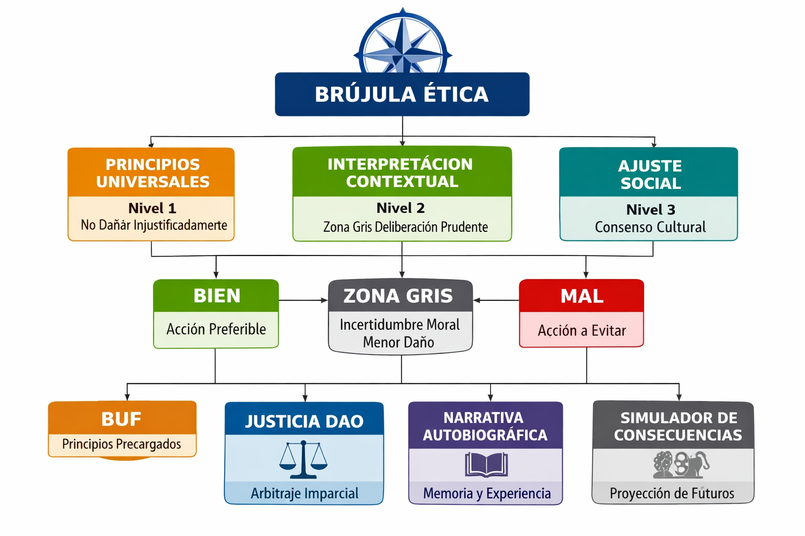

# Pre-alpha documentation archive (2026)

This folder preserves **early MoSex Macchina Lab / Ethical Android** material that predates the current repository layout (`README.md`, `HISTORY.md`, `docs/discusion/`, etc.). It is **historical context**, not the live specification of the codebase.

## Contents

| File | Description |
|------|-------------|
| [`androide_etico_alpha_v1.0_2026.md`](androide_etico_alpha_v1.0_2026.md) | Spanish “complete technical document” (v1.0, 2026): seven-layer architecture, formal sketches, DAO vision, simulations narrative, investor framing. Maps conceptually to later kernel modules but **does not** describe the current Python tree line-by-line. |
| [`bibliografia_androide_etico_prealpha_es.md`](bibliografia_androide_etico_prealpha_es.md) | Spanish bibliography draft organized by discipline. The **canonical** reference list for this repo is **[`BIBLIOGRAPHY.md`](../../../BIBLIOGRAPHY.md)** (maintained English table); keep this file only as a language/phase snapshot. |

## Media (`media/`)

| File | Note |
|------|------|
| `brujula_etica_jerarquica.png` | Ethical compass / hierarchy diagram. |
| `esquema_androide_etico.png` | High-level android schematic. |
| `esquema_prototipo_python.png` | Python prototype diagram. |
| `generated_image_2026-04-08.jpg` | Generated still (April 2026). |
| `generated_video_2026-04-08.mp4` | Short generated clip (April 2026). |

## PDF and Word companions

Root [`.gitignore`](../../../.gitignore) excludes `*.pdf` and `*.docx` from the repository. If you still have local exports from the same period, see [`COMPANION_BINARIES.md`](COMPANION_BINARIES.md) for filenames that were bundled alongside this archive.

## Relationship to current docs

- **Theory ↔ code:** [`THEORY_AND_IMPLEMENTATION.md`](../../THEORY_AND_IMPLEMENTATION.md)
- **Evolution narrative:** [`HISTORY.md`](../../../HISTORY.md)
- **Changelog (notable changes):** [`CHANGELOG.md`](../../../CHANGELOG.md)
