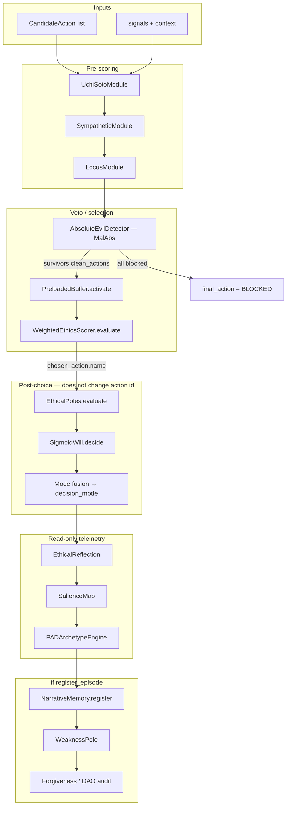

# Core decision chain (MalAbs → action)

**Audience:** reviewers and integrators who need a **single map** from inputs to `KernelDecision.final_action`, without reading all of `src/kernel.py` first.

**Cross-refs:** orchestration in [`src/kernel.py`](../src/kernel.py) (`EthicalKernel.process`), theory in [`THEORY_AND_IMPLEMENTATION.md`](THEORY_AND_IMPLEMENTATION.md), runtime boundaries in [`RUNTIME_CONTRACT.md`](RUNTIME_CONTRACT.md), packaging spike in [`adr/0001-packaging-core-boundary.md`](adr/0001-packaging-core-boundary.md), core subpackage in [`src/core/`](../src/core/). **Phase 2 extension seam (optional):** in-process event bus [`adr/0006-phase2-core-boundary-and-event-bus.md`](../adr/0006-phase2-core-boundary-and-event-bus.md) (`KERNEL_EVENT_BUS`). **Mixture-weight nudges** (optional, before `evaluate`): episodic refresh (`KERNEL_BAYESIAN_EMPIRICAL_WEIGHTS`, see [README](README.md)), temporal-horizon prior [`TEMPORAL_PRIOR_HORIZONS.md`](TEMPORAL_PRIOR_HORIZONS.md) (`KERNEL_TEMPORAL_HORIZON_PRIOR`) — see [`weighted_ethics_scorer.py`](../src/modules/weighted_ethics_scorer.py) ([ADR 0009](../adr/0009-ethical-mixture-scorer-naming.md); `bayesian_engine.py` is a compat shim). **Module count vs empirical ablation gap:** [`MODULE_IMPACT_AND_EMPIRICAL_GAP.md`](MODULE_IMPACT_AND_EMPIRICAL_GAP.md).

---

## Flow (batch path `process`)

The LLM is **not** on this path unless a higher layer calls `process_natural` / `process_chat_turn` first (those still end in `process` with structured `signals` and `CandidateAction` lists).

---

## Who sets `final_action`?

In `EthicalKernel.process`, **`final_action` is the string name of a surviving candidate**:

| Stage | Module(s) | Effect on `final_action` |
|-------|-----------|---------------------------|
| MalAbs | `AbsoluteEvilDetector` | **Veto:** drops candidates; if none remain → `"BLOCKED: no permitted actions"`. |
| Scoring / choice | `WeightedEthicsScorer` (alias `BayesianEngine`) | **Selects** `chosen_action` among MalAbs survivors (prune + argmax expected impact in `evaluate`). |
| Buffer | `PreloadedBuffer.activate` | **Does not** pass principles into mixture `evaluate` in the current code; L0 / constitution side effects apply elsewhere (see buffer + moral hub docs). |
| Poles | `EthicalPoles` | **No:** evaluates the **already chosen** action name; updates multipolar verdict / score for audit and LLM tone. |
| Will | `SigmoidWill` | **No:** feeds **mode** (`gray_zone`, etc.); `final_mode` merges will + sympathetic + locus + mixture / gray-zone mode. |
| Reflection / salience / PAD | `EthicalReflection`, `SalienceMap`, `PADArchetypeEngine` | **No** (read-only on policy). |
| Memory / weakness / DAO | `NarrativeMemory`, `WeaknessPole`, `MockDAO`… | **No:** run **after** `final_action` is fixed (when `register_episode` is true). |

**Optional noise:** `VariabilityEngine`, when active, perturbs impact/confidence **inside** `WeightedEthicsScorer` inputs — still within the same MalAbs → mixture selection machinery.

**Chat path:** `process_chat_turn` may supply different candidate sets or block at the **text** gate (`evaluate_chat_text`); once `process` runs, the same rule applies: **`final_action` comes from `bayesian_result.chosen_action.name` (field name on `KernelDecision`) or a MalAbs block.**

---

## Injecting subsystems (tests and experiments)

`EthicalKernel` accepts optional `components=KernelComponentOverrides(...)` ([`src/kernel_components.py`](../src/kernel_components.py)) so callers can substitute concrete module instances (stubs, subclasses, or alternate implementations) **without** editing `kernel.py`. Top-level `llm` and `checkpoint_persistence` keyword arguments **override** the same-named fields inside `components` when provided. This is structural injection, not a stable cross-version plugin ABI: replacements should match the methods the orchestrator calls.

---

## “Core” vs “theater” (product boundary)

Rough split for packaging and mental model — not a hard import graph yet (see [ADR 0001](../adr/0001-packaging-core-boundary.md), [ADR 0006](../adr/0006-phase2-core-boundary-and-event-bus.md)):

| Tier | Includes | Role |
|------|----------|------|
| **Core policy** | [`src/core/`](../src/core/) — MalAbs, buffer (L0), `WeightedEthicsScorer` (`BayesianEngine` alias), `EthicalPoles`, `SigmoidWill`, sympathetic / locus / uchi-soto as wired in `process` | Deterministic ethical choice + modes. |
| **Narrative & audit** | `NarrativeMemory`, weakness, forgiveness, DAO mock, hub hooks | Identity and traceability; **do not** replace the core argmax. |
| **Advisory / UX** | PAD, reflection, salience, LLM `communicate`, WebSocket JSON extras | Tone and transparency; **read-only** on `final_action` per contract. HCI / poles honesty: [POLES_WEAKNESS_PAD_AND_PROFILES.md](POLES_WEAKNESS_PAD_AND_PROFILES.md). |
| **Runtime** | FastAPI, persistence, checkpoints, LAN clients | Deployment; **does not** redefine ethics ([`RUNTIME_CONTRACT.md`](RUNTIME_CONTRACT.md)). Optional **`KernelEventBus`** (`KERNEL_EVENT_BUS`) publishes JSON-safe summaries after the core path — for bridges only; see [PROPOSAL_PHASE2_CORE_EXTENSIONS_AND_EVENT_BUS.md](PROPOSAL_PHASE2_CORE_EXTENSIONS_AND_EVENT_BUS.md). |

---

*Issue 4 deliverable — MoSex Macchina Lab.*
