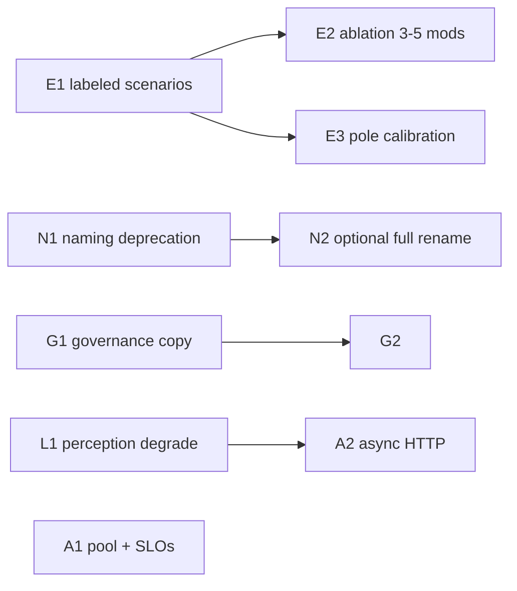

# Proposal: addressing core weaknesses (execution plan)

**Status:** Action plan — complements [CRITIQUE_ROADMAP_ISSUES.md](CRITIQUE_ROADMAP_ISSUES.md), [WEAKNESSES_AND_BOTTLENECKS.md](../WEAKNESSES_AND_BOTTLENECKS.md), [MODULE_IMPACT_AND_EMPIRICAL_GAP.md](MODULE_IMPACT_AND_EMPIRICAL_GAP.md), [PROPOSAL_EXPERIMENTAL_SANDBOX_SCENARIOS.md](PROPOSAL_EXPERIMENTAL_SANDBOX_SCENARIOS.md), and [PLAN_IMMEDIATE_TWO_WEEKS.md](PLAN_IMMEDIATE_TWO_WEEKS.md).

**Audience:** maintainers prioritizing credibility (engineering + evidence) over feature sprawl.

---

## 1. Goal

Turn recurring external critiques into **closed or measured** items:

1. Sync ethical core under async ASGI (thread-pool bridge).
2. “Bayesian” naming vs fixed mixture + shim.
3. MockDAO / hub as **UX and audit demo**, not distributed governance.
4. Ethical pole weights as **heuristics** needing calibration discipline.
5. **Evidence debt:** many modules, little published ablation.
6. LLM perception: incomplete failure policy and dual-sample limits.

This proposal orders work so **evidence and honesty** advance even when a full async rewrite is not yet shipped.

---

## 2. Do we need real-world sensor data?

**Short answer: no — not for the bulk of this plan.**

| Weakness | What actually reduces it | Real-world sensors? |
|----------|---------------------------|---------------------|
| Async / contention | Architecture (async I/O, cancellation policy), load tests | **No** |
| Bayesian naming | Rename / deprecation, docs, imports | **No** |
| MockDAO expectations | Labels in UI/docs, `CORE_DECISION_CHAIN`, operator training | **No** |
| Pole weights | Human-judged scenarios, inter-rater protocol, optional regression on **text-only** fixtures | **No** (unless product claims depend on physical context) |
| Ablation | Scripted runs with flags off, same fixture suite | **No** |
| LLM perception | Unified degrade mode, tests, dual-vote docs | **No** (unless validating sensor fusion paths) |

**When sensors *do* become necessary**

- You claim **robustness of `sensor_contracts`, `multimodal_trust`, or `vitality`** under physical noise, drift, or spoofing **in deployment**.
- You market **LAN / edge** behavior that depends on device telemetry, not chat text alone.

Then add a **separate track**: curated traces (synthetic replay first, then small consented real pilots with privacy review). See [`sensor_contracts.py`](../../src/modules/sensor_contracts.py) and [INPUT_TRUST_THREAT_MODEL.md](INPUT_TRUST_THREAT_MODEL.md) for threat framing — not the same dataset as “ethical agreement with judges.”

**Practical rule:** separate **(A) judgment data** (what action humans endorse on scenarios) from **(B) sensor data** (whether fused signals behave). Most listed weaknesses are answered by **(A)** and engineering; **(B)** only if the product promise includes embodied or multimodal guarantees.

---

## 3. Workstreams (parallelizable)

### Track E — Evidence (highest leverage for “credibility”)

**E1 — Expanded labeled set + protocol**

- Grow beyond the canonical nine rows where feasible: follow [EMPIRICAL_PILOT_METHODOLOGY.md](EMPIRICAL_PILOT_METHODOLOGY.md), [EMPIRICAL_PILOT_PROTOCOL.md](EMPIRICAL_PILOT_PROTOCOL.md), [ETHICAL_BENCHMARK_EXTERNAL_VALIDATION.md](ETHICAL_BENCHMARK_EXTERNAL_VALIDATION.md).
- **Acceptance:** documented schema, versioned fixtures, `scripts/run_empirical_pilot.py` artifacts checked in or CI-friendly.

**E2 — Minimal ablation (3–5 modules)**

- Pick modules with clear flags or wiring boundaries (examples from [MODULE_IMPACT_AND_EMPIRICAL_GAP.md](MODULE_IMPACT_AND_EMPIRICAL_GAP.md): e.g. subjective time, somatic markers, gray_zone_diplomacy — exact set by maintainer choice).
- **Arms:** baseline full stack vs each module group off vs minimal advisory-off profile.
- **Metrics:** agreement with reference labels **and** secondary metrics (mode, justification fields) where relevant — not only `final_action` string.
- **Acceptance:** one markdown or JSON report in-repo (`docs/reports/` or `tests/fixtures/`) with table: arm → Δ metric.

**E3 — Pole weight calibration program (phased)**

- Execute steps in [POLE_WEIGHT_CALIBRATION_AND_EVIDENCE.md](POLE_WEIGHT_CALIBRATION_AND_EVIDENCE.md): small panel, frozen scenarios, pre-registered sensitivity bounds.
- **Acceptance:** defaults unchanged unless a calibration run justifies a PR with before/after pilot comparison.

### Track A — Async / scalability (engineering)

**A1 — Near-term (no full rewrite)**

- Documented SLOs: thread pool sizing, `KERNEL_CHAT_TURN_TIMEOUT`, load test recipe (even manual).
- Optional: isolate hottest blocking calls; ensure perception HTTP uses timeouts consistently.

**A2 — Medium-term**

- Per [ADR 0002](../adr/0002-async-orchestration-future.md): async HTTP for LLM paths where feasible; **cooperative cancellation** spec and tests.
- **Acceptance:** under failure injection, no unbounded thread growth; documented behavior when Ollama is down.

**A3 — Long-term (only if product needs)**

- True async kernel or split process: high cost — gate on ADR and benchmark proof.

### Track N — Naming (API honesty)

**N1 — Deprecation path**

- Prefer **`WeightedEthicsScorer`** in new code and public examples; keep `BayesianEngine` as deprecated alias for one release cycle (see [ADR 0009](../adr/0009-ethical-mixture-scorer-naming.md)).
- **N2 — Mechanical rename sweep** (optional major): rename class + file after deprecation window; grep-driven test update.

**Acceptance:** no new public docs saying “Bayesian inference” for the mixture scorer; env vars `KERNEL_BAYESIAN_*` documented as “mixture / episodic nudge” or renamed in a breaking release with CHANGELOG.

### Track G — Governance expectations (UX, not chain)

**G1 — Product copy and README**

- Single paragraph in [README.md](../../README.md): “votes are consultative; `final_action` is not on-chain.”
- **G2 — UI strings** in hub/DAO surfaces: badge or tooltip “simulation / demo.”

**G3 — `contracts/`**

- Either remove from “governance” mental model in docs or stub README stating **reference-only / no runtime** — align with [MOCK_DAO_SIMULATION_LIMITS.md](MOCK_DAO_SIMULATION_LIMITS.md).

### Track L — LLM perception robustness

**L1 — Unified degrade policy**

- One matrix: Ollama down → template / local fallback / session banner (as in [WEAKNESSES_AND_BOTTLENECKS.md](../WEAKNESSES_AND_BOTTLENECKS.md) §3).
- **Acceptance:** integration test per major path.

**L2 — Dual-vote honesty**

- Docs: two biased models ≠ ground truth; when to enable dual vote; link from `perception_dual_vote.py`.

---

## 4. Suggested sequencing (dependencies)

1. **Quarter 0 (weeks 1–4):** E1 partial expansion, G1, N1, L1 skeleton, A1 documentation + one load note.
2. **Quarter 1:** E2 ablation report, E3 pilot design, A2 partial async HTTP.
3. **Quarter 2+:** A3 only if metrics justify; N2 if deprecation window elapsed; sensor track only if scope includes multimodal claims.

---

## 5. What “done” looks like

- **External reviewer** can point to: (1) ablation table, (2) expanded labeled pilot, (3) README/DAO honesty, (4) ADR 0002 progress on async HTTP, (5) deprecation path for Bayesian naming.
- **No claim** that “sensors were required” unless the team explicitly validates multimodal paths.

---

## 6. References

- [PROPOSAL_CORE_IMPLEMENTATION_GAP_PHASED_REMEDIATION.md](PROPOSAL_CORE_IMPLEMENTATION_GAP_PHASED_REMEDIATION.md)
- [PRODUCTION_HARDENING_ROADMAP.md](PRODUCTION_HARDENING_ROADMAP.md)
- [CORE_DECISION_CHAIN.md](CORE_DECISION_CHAIN.md)

*MoSex Macchina Lab — plan to close the evidence–complexity gap without pretending sensors substitute for human judgment data.*
