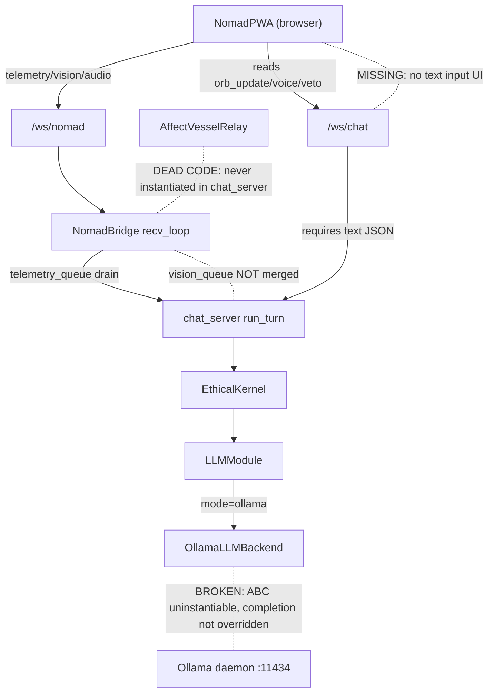

# Diagnostico Ollama-Nomad Chat Connectivity (L1 Review)

## Scope

This document explains why local Ollama is not reliably connecting to Nomad chat in the current codebase, with evidence from runtime wiring, adapter contracts, and client/bridge integration.

Target surfaces reviewed:
- [`src/modules/llm_layer.py`](src/modules/llm_layer.py)
- [`src/modules/llm_backends.py`](src/modules/llm_backends.py)
- [`src/chat_server.py`](src/chat_server.py)
- [`src/modules/nomad_bridge.py`](src/modules/nomad_bridge.py)
- [`src/kernel_lobes/perception_lobe.py`](src/kernel_lobes/perception_lobe.py)
- [`src/modules/vitality.py`](src/modules/vitality.py)
- [`src/modules/sensor_contracts.py`](src/modules/sensor_contracts.py)
- [`src/modules/perceptual_abstraction.py`](src/modules/perceptual_abstraction.py)
- [`src/modules/affect_projection_relay.py`](src/modules/affect_projection_relay.py)
- [`src/clients/nomad_pwa/app.js`](src/clients/nomad_pwa/app.js)
- [`src/clients/nomad_pwa/media_engine.js`](src/clients/nomad_pwa/media_engine.js)
- [`tests/test_llm_backend_adapters.py`](tests/test_llm_backend_adapters.py)
- [`tests/test_nomad_bridge_stream.py`](tests/test_nomad_bridge_stream.py)

## Expected End-to-End Path

Dashed lines (`-.-`) indicate broken or missing paths identified in this diagnostic.

## Root-Cause Findings

## P0 (Critical) - Direct blockers for Ollama chat reliability

1. **Broken Ollama backend contract in implementation**
   - In [`src/modules/llm_backends.py`](src/modules/llm_backends.py), `OllamaLLMBackend` is declared as a concrete `LLMBackend` but does not provide a sync `completion()` implementation, while the base class requires it.
   - `_ollama_chat_payload()` is typed as `dict[str, Any]` but returns a stripped message string and also references `url` that is not defined in that method.
   - `acompletion()` calls `self._ollama_chat_response_text(data)` but no such method exists in the class.
   - `aembedding()` references `self._aclient`, which is never initialized in `__init__`.
   - Impact: local Ollama mode can fail before/at first turn even when Ollama daemon is healthy.

   **Code evidence (second pass, 2026-04-23):**
   - `_ollama_chat_payload()` at `llm_backends.py:281-310` is a broken monolith: typed `-> dict[str, Any]` but lines 294-310 perform a full sync HTTP call and return `(msg.get("content") or "").strip()` (a `str`). Variable `url` on lines 297, 301, 306 is undefined in this scope (it only exists in `acompletion()` at line 315). When `acompletion()` at line 316 calls `self._ollama_chat_payload(...)`, the returned string is passed to `client.post(url, json=payload)` which will serialize the string as a JSON scalar, not as an Ollama chat payload.
   - `_ollama_chat_response_text()` is called at `llm_backends.py:322` but never defined anywhere in `OllamaLLMBackend` or its base. This is an unconditional `AttributeError` on every async completion call.
   - `self._aclient` at `llm_backends.py:385` is read in `aembedding()` but `__init__` at lines 258-276 never assigns it. The attribute does not exist; the `if self._aclient is not None` guard will raise `AttributeError` instead of falling through to the `else` branch.

2. **Constructor mismatch between LLM layer and Ollama backend**
   - In [`src/modules/llm_layer.py`](src/modules/llm_layer.py), `LLMModule.__init__` passes `aclient=self._aclient_internal` to `OllamaCompletion(...)`.
   - In [`src/modules/llm_backends.py`](src/modules/llm_backends.py), `OllamaLLMBackend.__init__` does not accept `aclient`.
   - Impact: mode `ollama` can break with argument mismatch at backend construction time.

   **Code evidence (second pass, 2026-04-23):**
   - `llm_layer.py:404-408` constructs `OllamaCompletion(base_url, model, timeout, aclient=self._aclient_internal)`.
   - `llm_backends.py:258-266` signature is `__init__(self, base_url, model, timeout, *, embed_model=None, embed_timeout=None)`. No `aclient` keyword. Python raises `TypeError: OllamaLLMBackend.__init__() got an unexpected keyword argument 'aclient'` at runtime.

3. **Test contract and runtime contract are desynchronized**
   - [`tests/test_llm_backend_adapters.py`](tests/test_llm_backend_adapters.py) expects `OllamaLLMBackend(...).completion(...)` to work against `/api/chat`.
   - Current implementation shape in [`src/modules/llm_backends.py`](src/modules/llm_backends.py) does not match that expectation.
   - Impact: adapter behavior is unstable across test/runtime and difficult to trust in production.

4. **`OllamaLLMBackend` is uninstantiable as an ABC** *(new, second pass)*
   - `LLMBackend.completion()` is `@abstractmethod` at `llm_backends.py:73`. `OllamaLLMBackend` (lines 248-405) never overrides `completion()`. The code that was likely intended to be the sync `completion()` body was accidentally placed inside `_ollama_chat_payload()` during a refactor (lines 294-310).
   - Python should raise `TypeError: Can't instantiate abstract class OllamaLLMBackend with abstract method completion` at construction time. The only reason tests may not crash is if `OllamaCompletion` (alias at line 548) is mocked or test fixtures bypass direct instantiation.
   - Impact: even with all env vars correctly set, creating an `LLMModule(mode="ollama")` is fundamentally broken at the Python level.

## P1 (High) - Integration gaps between Nomad streams and LLM turn input

1. **Nomad vision stream is not merged into main chat snapshot**
   - Nomad bridge receives and queues `vision_frame` in [`src/modules/nomad_bridge.py`](src/modules/nomad_bridge.py).
   - `snapshot_from_layers()` in [`src/modules/perceptual_abstraction.py`](src/modules/perceptual_abstraction.py) only merges fixture/preset/client dict and does not merge vision consumer output.
   - `merge_nomad_vision_into_snapshot()` exists in [`src/modules/sensor_contracts.py`](src/modules/sensor_contracts.py) (line 318) but appears only in its own tests, not in the chat turn pipeline.
   - Impact: camera stream does not consistently influence LLM turn context in the default Nomad chat path.

2. **Nomad ping/pong contract mismatch**
   - PWA sends `{"type":"ping","payload":{}}` in [`src/clients/nomad_pwa/app.js`](src/clients/nomad_pwa/app.js), expecting `pong`.
   - Bridge rejects empty payload envelopes via `if not event_type or not payload` in [`src/modules/nomad_bridge.py`](src/modules/nomad_bridge.py).
   - Impact: RTT/heartbeat expectation in client is logically disconnected from server behavior.

3. **Affective orb path is partially disconnected**
   - PWA updates orb on `msg.type === 'orb_update'` in [`src/clients/nomad_pwa/app.js`](src/clients/nomad_pwa/app.js).
   - Bridge sender emits `type: "charm_feedback"` for queue payloads in [`src/modules/nomad_bridge.py`](src/modules/nomad_bridge.py).
   - `AffectVesselRelay` creates `orb_update` payloads in [`src/modules/affect_projection_relay.py`](src/modules/affect_projection_relay.py), but this relay is not wired into server runtime flow (only present with its own test usage).
   - Impact: emotional state signaling to Nomad UI is inconsistent and can appear as "chat not connected" from operator perspective.

## P1-ARCH (High) - Architectural design gaps preventing Nomad chat *(new, second pass)*

4. **Nomad PWA has no chat input -- it is sensor-only**
   - [`src/clients/nomad_pwa/index.html`](src/clients/nomad_pwa/index.html) contains no text input field, no chat box, and no send button for user messages. The entire UI consists of a status header, an affective orb, a read-only transcript area (`#charm-transcript`), and control buttons (Install, Connect, Start Sensors).
   - `app.js` connects to `/ws/chat` (line 129) but only reads responses — it handles `msg.role === 'android'`, `msg.type === 'veto'`, `msg.type === 'orb_update'`, `msg.type === 'kernel_voice'`, etc. It never sends `{"text": "..."}` to trigger a chat turn.
   - Impact: even if Ollama worked perfectly and all bridges were wired, the Nomad client **cannot initiate a conversation**. There is no chat interaction loop, only passive display of kernel output. This is the single most fundamental reason why "Ollama can't connect to Nomad chat" — the Nomad PWA was never designed to send chat messages.

5. **Dual-socket architecture creates inherent isolation between sensor and chat paths**
   - The PWA opens two independent WebSockets: `wsChat -> /ws/chat` (line 129) and `wsNomad -> /ws/nomad` (line 239).
   - `/ws/nomad` only accepts `vision_frame`, `audio_pcm`, `telemetry` in its `_recv_loop` (`nomad_bridge.py:298-371`). There is no chat message routing on this endpoint.
   - `/ws/chat` creates a fresh `EthicalKernel` per connection (`chat_server.py:2186`) but chat turns only trigger when a `{"text": "..."}` message arrives (`chat_server.py:2245`).
   - The bridge between them is one-way and passive: `chat_server.run_turn()` drains `nomad_bridge.telemetry_queue` into the sensor snapshot (`chat_server.py:2260-2269`), but this drain only fires when someone sends a text message on `/ws/chat`.
   - Impact: sensor data accumulates in bridge queues with no consumer unless an external client (not the PWA itself) sends chat text on a separate `/ws/chat` connection. The architecture lacks a trigger mechanism for autonomous chat turns based on sensor input.

6. **`AffectVesselRelay` is dead code in production** *(upgraded from P1.3)*
   - `AffectVesselRelay` in [`src/modules/affect_projection_relay.py`](src/modules/affect_projection_relay.py) (line 13) creates `orb_update` payloads and enqueues them into `self.bridge.charm_feedback_queue` (lines 58-63).
   - `chat_server.py` never imports or instantiates `AffectVesselRelay` — confirmed with zero grep matches across the entire file (2556+ lines).
   - The relay exists only in its own test fixtures. At runtime, `charm_feedback_queue` is never populated by the affect system, so `_send_loop` in `nomad_bridge.py:378-389` blocks forever on `await self.charm_feedback_queue.get()` without sending anything.
   - Impact: the affect feedback loop (kernel emotion -> Nomad orb visual) is architecturally designed but **never wired**. The Nomad PWA receives no emotional state updates at runtime.

## P2 (Medium) - Configuration and operability drift

1. **Environment defaults drift across docs and code**
   - [`src/modules/llm_layer.py`](src/modules/llm_layer.py) defaults: `OLLAMA_BASE_URL=http://127.0.0.1:11434`, `OLLAMA_MODEL=llama3.2:3b`, `OLLAMA_TIMEOUT=120`.
   - [`docs/ENV_VAR_CATALOG.md`](docs/ENV_VAR_CATALOG.md) documents: `http://localhost:11434`, `llama3`, timeout `60`.
   - [` .env.example`](.env.example) defaults to `LLM_MODE=local` while Ollama requires explicit mode change.
   - Impact: operators can believe Ollama is enabled while runtime resolves to local template mode or wrong timeout/model assumptions.

2. **Repository integration state increases incident risk**
   - Current local git state is in rebase/conflict (`UU`/`AA` paths shown by `git status`) while diagnosing.
   - Impact: even correct runtime logic can become nondeterministic when deployment branch is not in a stable, merged state.

3. **Ping/pong failure is Python truthiness specific** *(new, second pass)*
   - PWA sends `{"type": "ping", "payload": {}}` every 10 seconds (`app.js:265`).
   - Server check at `nomad_bridge.py:301` is `if not event_type or not payload:`. In Python, `not {}` evaluates to `True` because an empty dict is falsy. This silently rejects every ping as `invalid_envelope`.
   - The heartbeat (`{"type": "telemetry", "payload": {"heartbeat": true}}` at `app.js:254`) passes because its payload is non-empty.
   - This is not a schema design error but a Python falsy-dict semantics issue. Fix: change to `if not event_type or payload is None:` (explicit `None` check) to accept empty-but-present payloads.
   - Impact: the Nomad RTT indicator (`#nomad-rtt` in the PWA) never updates, reinforcing the operator perception that the bridge is disconnected.

## Connectivity Matrix (Current Behavior)

| Channel | Present in Nomad bridge | Reaches chat turn snapshot | Reaches LLM turn context reliably | Notes |
|---|---|---|---|---|
| **Chat text input** | **No** | **No** | **No** | **PWA has no text input UI; /ws/nomad has no chat routing** |
| Telemetry (`type=telemetry`) | Yes | Yes (`telemetry_queue` drain in chat server) | Yes (via snapshot + vitality merge) | Works with gap-fill policy |
| Audio RMS (`last_rms`) | Yes | Yes (`client["rms_audio"]`) | Yes | Limited to scalar energy |
| Vision frames (`type=vision_frame`) | Yes (`vision_queue`) | Not by default | No (default path) | Merge helper exists but not wired in main path |
| Orb affect (`orb_update`) | Relay dead code | Not routed (relay never instantiated) | No | `AffectVesselRelay` exists but `chat_server` never wires it |
| Ping/pong RTT | Client expects | No | No | Empty `{}` payload rejected by Python falsy-dict check |
| Ollama completion | Backend class exists | N/A | **No** | ABC uninstantiable; `completion()` not overridden; `_aclient` unset |

## Why Ollama appears "unable to connect" to Nomad chat

The issue is not a single network fault. It is a **layered design failure across four independent dimensions**:

1. **Adapter-level breakages**: `OllamaLLMBackend` is uninstantiable as a Python ABC (missing `completion()` override), its payload builder is a broken monolith (undefined `url`, wrong return type), `_ollama_chat_response_text()` is called but never defined, and the constructor rejects the `aclient` kwarg that `LLMModule` passes. Even with a healthy Ollama daemon, no completion call can succeed.

2. **No chat input pathway**: The Nomad PWA has no text input UI. It connects to `/ws/chat` as a read-only consumer of kernel output. Without a mechanism to send `{"text": "..."}`, no chat turn is ever triggered, so the Ollama backend is never invoked from the Nomad client flow.

3. **Sensor-to-chat fusion is passive and partial**: Telemetry from `/ws/nomad` reaches the chat snapshot only when a text message on `/ws/chat` triggers `run_turn()`. Vision frames are queued but never merged. The affect relay is dead code. The bridge is one-way and event-less.

4. **Configuration drift**: `.env.example` defaults to `LLM_MODE=local`, env var documentation disagrees with code defaults, and operators can believe Ollama is active when the runtime silently resolves to template mode.

## Remediation Proposal (Stabilization First)

## Phase P0 - Make Ollama adapter deterministic

1. Fix `OllamaLLMBackend` contract in [`src/modules/llm_backends.py`](src/modules/llm_backends.py):
   - **Extract sync `completion()` from `_ollama_chat_payload()`**: move the HTTP call + response extraction (lines 294-310) into a proper `completion(self, system, user, **kwargs)` override. This satisfies the ABC contract and makes instantiation possible.
   - **Make `_ollama_chat_payload()` return only the payload dict**: it should build `{"model", "messages", "stream", "options"}` and return it. Remove the HTTP call, the undefined `url` references, and the response extraction.
   - **Implement `_ollama_chat_response_text()`** as a static or instance method that extracts `data["message"]["content"]`, or inline the extraction in `acompletion()`.
   - **Initialize `self._aclient`** in `__init__` (accept `aclient: httpx.AsyncClient | None = None` as keyword argument and assign `self._aclient = aclient`), or remove the `_aclient` branch from `aembedding()`.
2. Align `LLMModule` constructor call in [`src/modules/llm_layer.py`](src/modules/llm_layer.py) with actual Ollama backend signature (pass `aclient` only if the backend accepts it).
3. Run adapter tests in [`tests/test_llm_backend_adapters.py`](tests/test_llm_backend_adapters.py) as first quality gate.

## Phase P1 - Close Nomad-to-chat semantic gaps

1. Integrate `merge_nomad_vision_into_snapshot()` into the default chat snapshot path (`ws_chat` pipeline in `chat_server.py:run_turn()`), not only in isolated tests.
2. Fix ping/pong contract in `nomad_bridge.py:301`:
   - Change `if not event_type or not payload:` to `if not event_type or payload is None:` so that empty dicts (e.g. `{"type": "ping", "payload": {}}`) are accepted.
   - Add an explicit `elif event_type == "ping":` handler that sends `{"type": "pong", "payload": {}}` back to the client.
3. Align affect channel contract:
   - either standardize on `charm_feedback` schema in client,
   - or emit `orb_update` on the chat socket consistently.

## Phase P1-ARCH - Close architectural gaps for Nomad chat *(new, second pass)*

4. **Add chat input to Nomad PWA** in [`src/clients/nomad_pwa/index.html`](src/clients/nomad_pwa/index.html):
   - Add a text input field and send button.
   - In `app.js`, send `{"text": userInput}` over `wsChat` when the user submits.
   - Display the kernel response in the transcript area.
   - This is a prerequisite for any Ollama-Nomad chat interaction.

5. **Wire `AffectVesselRelay` in `chat_server.py`**:
   - Import and instantiate `AffectVesselRelay` in the `/ws/chat` handler, passing `get_nomad_bridge()` as the bridge.
   - Call the relay after each chat turn with the kernel's affective state so `charm_feedback_queue` is populated and the Nomad PWA can receive `orb_update`-style payloads.
   - Alternatively, emit `orb_update` payloads directly from the chat handler to `wsChat` (bypassing the Nomad bridge for affect).

6. **Consider sensor-triggered autonomous turns**:
   - Evaluate whether the kernel should trigger proactive chat turns when sensor data arrives (e.g. battery critical, high audio RMS, vision anomaly) without waiting for explicit user text.
   - This would close the passive-bridge gap where sensor data accumulates without triggering LLM evaluation.

## Phase P2 - Operational coherence and L1 governance hardening

1. Reconcile defaults/documentation across:
   - [`src/modules/llm_layer.py`](src/modules/llm_layer.py)
   - [`.env.example`](.env.example)
   - [`docs/ENV_VAR_CATALOG.md`](docs/ENV_VAR_CATALOG.md)
2. Add an integration test that validates full path:
   - `/ws/nomad` telemetry/audio/vision input
   - `/ws/chat` turn output with Ollama backend active
   - expected fields in chat response and bridge state.
3. Enforce branch stability gate before merges (no unresolved rebase/conflict state).

## L1 Decision Summary

Recommended execution order:
1. **P0 immediately** — adapter correctness and constructor alignment. Without this, Ollama cannot instantiate.
2. **P1-ARCH.4 next** — add chat input to PWA. Without this, no chat turn can be initiated from Nomad.
3. **P1 then** — Nomad semantic integration parity for vision/affect/ping.
4. **P1-ARCH.5-6** — wire affect relay and evaluate autonomous turns.
5. **P2 final** — doc/env alignment + governance hardening.

This order addresses the failures in dependency order: backend must work before chat can work, and chat input must exist before integration gaps matter.

## Revision History

| Date | Pass | Author | Summary |
|---|---|---|---|
| 2026-04-23 | Initial | L2 Cursor | P0/P1/P2 findings from first code review pass |
| 2026-04-23 | Second | L2 Cursor | Code evidence with line numbers; P0.4 ABC uninstantiable; P1-ARCH.4 no chat input; P1-ARCH.5 dual-socket isolation; P1-ARCH.6 dead relay; P2.3 Python truthiness; updated diagram and connectivity matrix; extended remediation |
