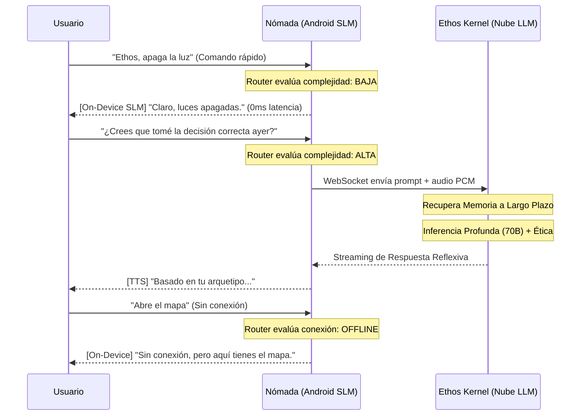

# Arquitectura Híbrida de Inteligencia (Local + Nube)

La arquitectura híbrida (On-Device + Cloud) maximiza la resiliencia, privacidad y potencia cognitiva de Ethos. 
El dispositivo Android no es solo una "pantalla bruta" (Thin Client), sino un **Nódulo Ganglionar** periférico con reflejos propios.

## Diagrama de Flujo Cognitivo Híbrido

## Responsabilidades del Nódulo (Android - SLM)
- **Reflejos Espinales:** Tareas instantáneas y comandos del sistema operativo (alarmas, abrir apps, hardware).
- **Percepción Base:** Detectar gritos, estrés en la voz o palabras clave usando STT local ligero sin enviar audio a la nube constantemente (Privacidad absoluta).
- **Fallback de Red:** Responder de forma coherente si el servidor se cae o no hay 5G.

## Responsabilidades del Cerebro (Servidor FastAPI - LLM/LMM)
- **Cortex Prefrontal:** Evaluación ética profunda, construcción de memoria a largo plazo y destilación de identidad (Psi-Sleep).
- **Modelos Pesados:** Razonamiento complejo que exceda las capacidades térmicas de un teléfono.
